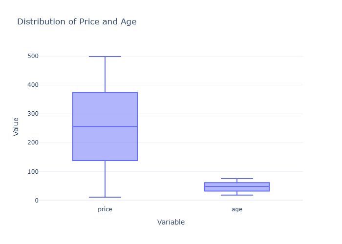
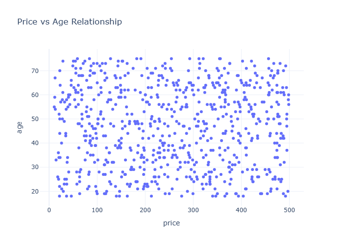
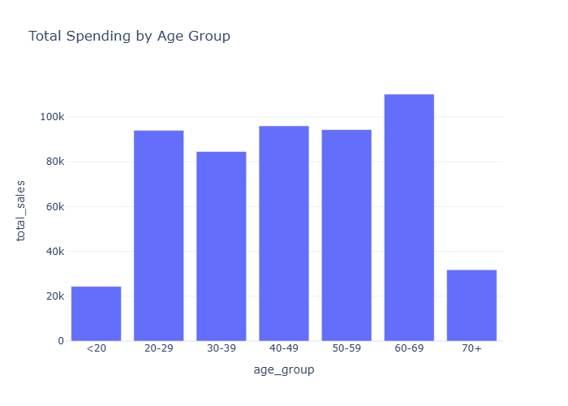

# Interactive Data Analysis Dashboard

This project provides interactive data visualizations using Plotly to analyze customer behavior, sales patterns, and demographics.

## Interactive Visualizations (with static previews)

Each section below shows a static preview image (click to open the full interactive HTML). The images are saved in the `docs/images/` folder and the interactive HTML versions are in `docs/` so they can be served via GitHub Pages.

---

### 1. Price and Age Distribution

Box plots (distribution) — click the image to open the interactive plot:

[](docs/price_age_box.html)

Scatter plot (price vs age):

[](docs/price_age_scatter.html)

Interactive features: hover for values, zoom/pan, and export with the camera icon.

---

### 2. Customer Lifetime Value (CLV) Analysis

Overall CLV distribution:

[](docs/clv_distribution.html)

CLV by gender:

[](docs/clv_by_gender.html)

CLV vs age:

[](docs/clv_vs_age.html)

---

### 3. Review and Purchase Analysis

Review score vs purchase frequency:

[](docs/review_vs_purchases.html)

---

### 4. Age-based Spending Patterns

Total spending by age group:

[](docs/age_spending.html)

---

### 5. Payment Methods Analysis

Payment method usage by gender:

[](docs/payment_methods.html)

---

## Getting Started

1. Clone this repository:
```bash
git clone https://github.com/Alcantara93/Alcantara93.git
cd Alcantara93
```

2. Install dependencies:
```bash
python -m pip install -r requirements.txt
```

3. Run the analysis:
```bash
python interactive_analysis.py
```

4. Open any `.html` file from the `docs/` directory in your web browser (or visit the GitHub Pages site) to interact with the visualizations.

## How to Use the Interactive Plots

Each visualization is an interactive HTML file that you can open in your web browser. To use them:

1. Clone and set up the repository
2. Run the analysis script
3. Navigate to the `docs/` directory
4. Open any `.html` file in your web browser
5. Interact with the plots:
   - 🔍 **Zoom**: Click and drag to zoom into specific areas
   - 🔄 **Reset**: Double-click to reset the view
   - 💡 **Details**: Hover over elements for detailed information
   - 🎨 **Legend**: Click legend items to show/hide data
   - 📷 **Export**: Use the camera icon to save as PNG

## Interactive Features Available

- 🔍 **Zoom & Pan**: Explore specific regions of each plot
- 💡 **Tooltips**: Hover over data points for detailed information
- 📊 **Interactive Legends**: Show/hide specific data series
- 📷 **Export Options**: Save visualizations as PNG/SVG
- 📱 **Responsive Design**: Works on desktop and mobile browsers
- 📈 **Statistical Insights**: Hover for numerical details
- 🎨 **Custom Views**: Toggle different aspects of the data

## Technical Requirements

### Software Requirements
- Python 3.x
- Plotly
- Pandas
- NumPy

### Data Requirements
The analysis expects a CSV file with these columns:
- `price`: Item price
- `age`: Customer age
- `quantity`: Number of items purchased
- `customer_id`: Unique identifier for each customer
- `gender`: Customer gender
- `review_score`: Product review rating
- `payment_method`: Method of payment used

## Running the Analysis

```bash
# Clone the repository
git clone https://github.com/Alcantara93/Alcantara93.git
cd Alcantara93

# Install dependencies
python -m pip install -r requirements.txt

# Run the analysis
python interactive_analysis.py

# Open any .html file from the outputs/ directory in your browser
```
